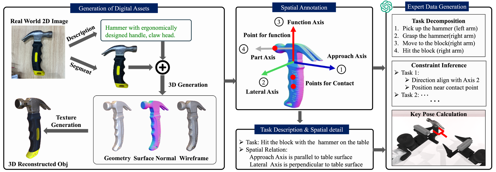
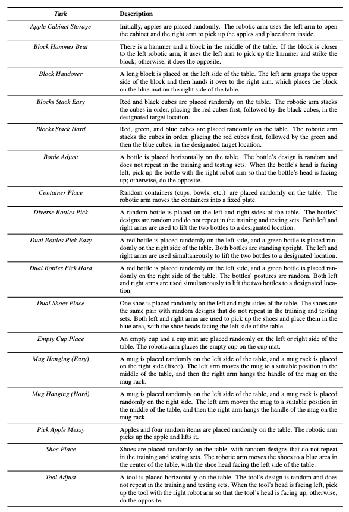
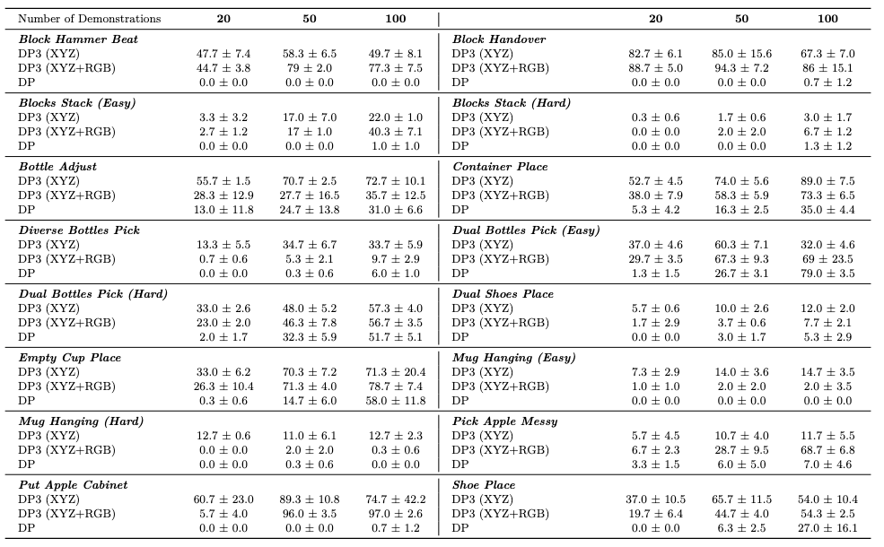
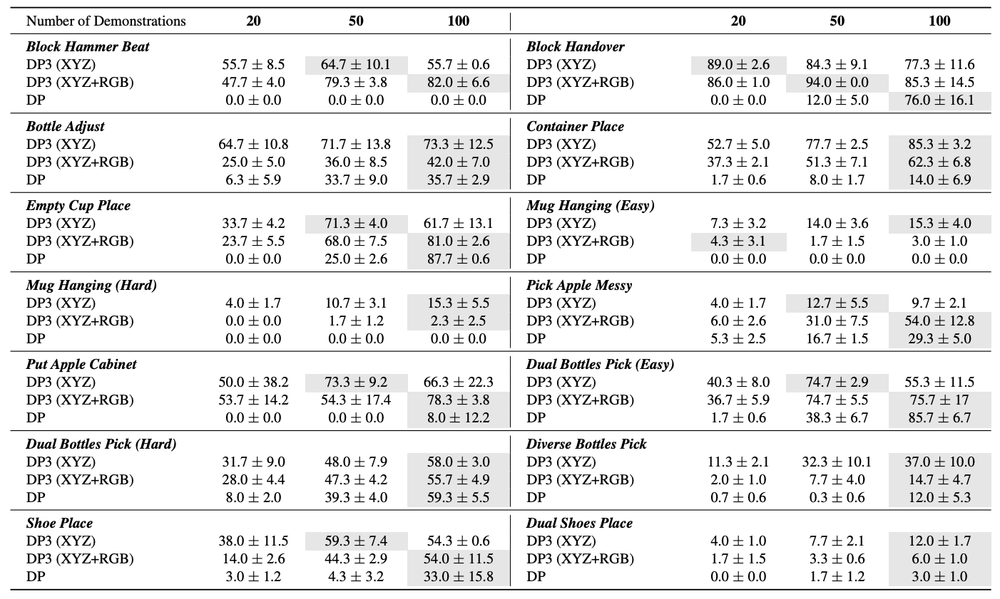

<h1 align="center">
	RoboTwin: Dual-Arm Robot Benchmark with Generative Digital Twins<br>
</h1>

https://private-user-images.githubusercontent.com/88101805/393158180-9d270912-821e-48c6-91a6-dd9746c5617c.mp4

<a href="https://yaomarkmu.github.io/">Yao Mu</a><sup>* †</sup>, <a href="https://tianxingchen.github.io">Tianxing Chen</a><sup>* </sup>, Zanxin Chen<sup>* </sup>, Shijia Peng<sup>*</sup>,<br>Zeyu Gao, Zhiqian Lan, Yude Zou, Lunkai Lin, Zhiqiang Xie, <a href="http://luoping.me/">Ping Luo</a><sup>†</sup>.

**Early Version**, accepted to <i style="color: red; display: inline;"><b>ECCV Workshop 2024 (Best Paper)</b></i>: [Webpage](https://robotwin-benchmark.github.io/early-version) | [PDF](https://arxiv.org/pdf/2409.02920) | [arXiv](https://arxiv.org/abs/2409.02920)<br>
<a href="https://hits.seeyoufarm.com"></a>

**Hardware Support**: AgileX Robotics (松灵机器人)
**Software Support**: D-robotics (地平线地瓜机器人)

# 📚 Overview

1. main Branch, [main branch](https://github.com/TianxingChen/RoboTwin/tree/main)
2. Code Generation Branch, [gpt branch](https://github.com/TianxingChen/RoboTwin/tree/gpt)
3. Early Version Branch, [early_version branch](https://github.com/TianxingChen/RoboTwin/tree/early_version)




# 🐣 Update
* **2024/12/06**, Released the manually fine-tuned expert data collector, and all RoboTwin code is now open source. Migrated the code from the early_version to the [early_version branch](https://github.com/TianxingChen/RoboTwin/tree/early_version).
* **2024/11/27**, Released the [gpt branch](https://github.com/TianxingChen/RoboTwin/tree/gpt), focused on generating expert data collectors for custom tasks. Note that its codebase differs slightly from the main branch.
* **2024/10/01**, Fixed the `get_actor_goal_pose` missing bug, updated the `get_obs()` function, and improved the Diffusion Policy-related code along with the experimental results.
* **2024/09/30**, RoboTwin (Early Version) received the Best Paper Award  at the ECCV Workshop!
* **2024/09/20**, Officially released RoboTwin.

**Applications and extensions of RoboTwin from the community:**

[arXiv 2411.18369](https://arxiv.org/abs/2411.18369), <i>G3Flow: Generative 3D Semantic Flow for Pose-aware and Generalizable Object Manipulation</i>, where 5 RoboTwin tasks are selected for benchmarking.

# 🛠️ Installation
> Please note that you need to strictly follow the steps: **Modify `mplib` Library Code** and **Download Assert**.

See [INSTALLATION.md](./INSTALLATION.md) for installation instructions. It takes about 20 minutes for installation.


# 🧑🏻‍💻 Usage 
## 1. Task Running and Data Collection
Running the following command will first search for a random seed for the target collection quantity (default is 100), and then replay the seed to collect data.

```
bash run_task.sh ${task_name} ${gpu_id}
```

## 2. Task Config
> We strongly recommend you to see [Config Tutorial](./CONFIG_TUTORIAL.md) for more details.

Data collection configurations are located in the `config` folder, corresponding to each task. 

The most important setting is `head_camera_type` (default is `L515`), which directly affects the visual observation collected. This setting indicates the type of camera for the head camera, and it is aligned with the real machine. You can see its configuration in `task_config/_camera_config.yml`.

## 3. Deploy your policy
See `envs/base_task.py`, search `TODO` and you may see the following code, make sure that `policy.get_action(obs)` will return action sequence (predicted actions).:
```
actions = model.get_action(obs) # TODO, get actions according to your policy and current obs
```

You need to modify `script/eval_policy.py` in the root directory to load your model for evaluation: Search `TODO`, modify the code to init your policy. 

# 🚴‍♂️ Baselines
## 1. Diffusion Policy
The DP code can be found in `policy/Diffusion-Policy`.

Process Data for DP training after collecting data (In root directory), and input the task name, head_camera_type and the amount of data you want your policy to train with (In fact, this step is not necessary; you can directly run the `train.sh` script. When there is no corresponding data detected, we will automatically perform this step):
```
python script/pkl2zarr_dp.py ${task_name} ${head_camera_type} ${expert_data_num}
# As example: python script/pkl2zarr_dp.py block_hammer_beat L515 100, which indicates preprocessing of 100 block_hammer_beat task trajectory data using L515 camera.
```

Then, move to `policy/Diffusion-Policy` first, and run the following code to train DP:
```
bash train.sh ${task_name} ${head_camera_type} ${expert_data_num} ${seed} ${gpu_id}
# As example: bash train.sh block_hammer_beat L515 100 0 0
```

Run the following code to evaluate DP for a specific task for 100 times:
```
bash eval.sh ${task_name} ${head_camera_type} ${expert_data_num} ${checkpoint_num} ${seed} ${gpu_id}
# As example: bash eval.sh block_hammer_beat L515 100 300 0 0
```

## 2. 3D Diffusion Policy
The DP3 code can be found in `policy/3D-Diffusion-Policy`.

Process Data for DP3 training after collecting data (In the root directory), and input the task name and the amount of data you want your policy to train with (In fact, this step is not necessary; you can directly run the `train.sh` script. When there is no corresponding data detected, we will automatically perform this step):
```
python script/pkl2zarr_dp3.py ${task_name} ${head_camera_type} ${expert_data_num}
# As example: python script/pkl2zarr_dp3.py block_hammer_beat L515 100
```

Then, move to `policy/3D-Diffusion-Policy` first, and run the following code to train DP3:
```
bash train.sh ${task_name} ${head_camera_type} ${expert_data_num} ${seed} ${gpu_id}
# As example: bash train.sh block_hammer_beat L515 100 0 0
# if use color: use `train_rgb.sh` instead
```

Run the following code to evaluate DP3 for a specific task:
```
bash eval.sh ${task_name} ${head_camera_type} ${expert_data_num} ${checkpoint_num} ${seed} ${gpu_id}
# As example: bash eval.sh block_hammer_beat L515 100 3000 0 0
# if use color: use `eval_rgb.sh` instead
```

# 🚀 Task Information

<table>
  <tr>
    <td>
      <h2>Descriptions</h2>
      
    </td>
    <td>
      <h2>Task Name → <code>${task_name}</code></h2>
      <table>
        <tr>
          <th>Task Name</th>
          <th><code>\${task_name}</code></th>
        </tr>
        <tr>
          <td>Block Hammer Beat</td>
          <td>block_hammer_beat</td>
        </tr>
        <tr>
          <td>Block Handover</td>
          <td>block_handover</td>
        </tr>
        <tr>
          <td>Blocks Stack (Easy)</td>
          <td>blocks_stack_easy</td>
        </tr>
        <tr>
          <td>Blocks Stack (Hard)</td>
          <td>blocks_stack_hard</td>
        </tr>
        <tr>
          <td>Bottle Adjust</td>
          <td>bottle_adjust</td>
        </tr>
        <tr>
          <td>Container Place</td>
          <td>container_place</td>
        </tr>
        <tr>
          <td>Diverse Bottles Pick</td>
          <td>diverse_bottles_pick</td>
        </tr>
        <tr>
          <td>Dual Bottles Pick (Easy)</td>
          <td>dual_bottles_pick_easy</td>
        </tr>
        <tr>
          <td>Dual Bottles Pick (Hard)</td>
          <td>dual_bottles_pick_hard</td>
        </tr>
        <tr>
          <td>Dual Shoes Place</td>
          <td>dual_shoes_place</td>
        </tr>
        <tr>
          <td>Empty Cup Place</td>
          <td>empty_cup_place</td>
        </tr>
        <tr>
          <td>Mug Hanging (Easy)</td>
          <td>mug_hanging_easy</td>
        </tr>
        <tr>
          <td>Mug Hanging (Hard)</td>
          <td>mug_hanging_hard</td>
        </tr>
        <tr>
          <td>Pick Apple Messy</td>
          <td>pick_apple_messy</td>
        </tr>
        <tr>
          <td>Put Apple Cabinet</td>
          <td>put_apple_cabinet</td>
        </tr>
        <tr>
          <td>Shoe Place</td>
          <td>shoe_place</td>
        </tr>
	<tr>
          <td>Tool Adjust</td>
          <td>tool_adjust</td>
        </tr>
      </table>
    </td>
  </tr>
</table>

# 🏄‍♂️ Current Leaderboard
## L515


## D435


# 🪄 Digital Twin Generation

Deemos Rodin: [https://hyperhuman.deemos.com/rodin](https://hyperhuman.deemos.com/rodin).

# 📦 Real Robot Data collected by Teleoperation

🦾 ARIO, All Robots In One: [https://ario-dataset.github.io/](https://ario-dataset.github.io/).

Coming Soon !

# ⁉️ Common Issues
If you find you fail to quit the running Python process with `Crtl + C`, just try `Ctrl + \`.

We found Vulkan is not stable in some off-screen devices, try reconnecting `ssh -X ...` if you meet any problem.

Other Common Issues can be found in [COMMON_ISSUE](./COMMON_ISSUE.md).

# ⏱️ Future Plans
1. Paper of RoboTwin (Final Version) will be released soon.
2. Real Robot Data collected by teleoperation.
3. More baseline code will be integrated into this repository (RICE, ACT, Diffusion Policy).


# 👍 Citation
If you find our work useful, please consider citing:

RoboTwin: Dual-Arm Robot Benchmark with Generative Digital Twins (**early version**), accepted to <i style="color: red; display: inline;"><b>ECCV Workshop 2024 (Best Paper)</b></i>
```
@article{mu2024robotwin,
  title={RoboTwin: Dual-Arm Robot Benchmark with Generative Digital Twins (early version)},
  author={Mu, Yao and Chen, Tianxing and Peng, Shijia and Chen, Zanxin and Gao, Zeyu and Zou, Yude and Lin, Lunkai and Xie, Zhiqiang and Luo, Ping},
  journal={arXiv preprint arXiv:2409.02920},
  year={2024}
}
```

# 🏷️ License
This repository is released under the MIT license. See [LICENSE](./LICENSE) for additional details.

# 📞 中文交流群
欢迎加入RoboTwin用户反馈与维护微信群，也可以直接添加共一作者联系方式邀请进群（请附带备注）


