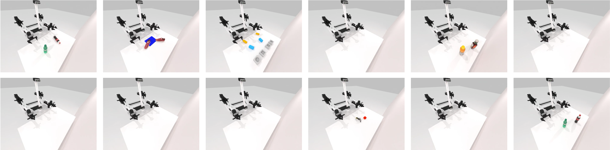

<h1 align="center">
	RoboTwin: Dual-Arm Robot Benchmark with Generative Digital Twins<br>
</h1>

<a href="https://yaomarkmu.github.io/">Yao Mu</a><sup>* †</sup>, <a href="https://tianxingchen.github.io">Tianxing Chen</a><sup>* </sup>, Zanxin Chen<sup>* </sup>, Shijia Peng<sup>*</sup>,<br>Zeyu Gao, Zhiqian Lan, Yude Zou, Lunkai Lin, Zhiqiang Xie, <a href="http://luoping.me/">Ping Luo</a><sup>†</sup>.


**RoboTwin (early version)**, accepted to <i style="color: red; display: inline;"><b>ECCV Workshop 2024 (Best Paper)</b></i>: [Webpage](https://robotwin-benchmark.github.io/early-version) | [PDF](https://arxiv.org/pdf/2409.02920) | [arXiv](https://arxiv.org/abs/2409.02920)<br>
<a href="https://hits.seeyoufarm.com"></a>


# 📚 Overview



# 🛠️ Installation
See [INSTALLATION.md](./INSTALLATION.md) for installation instructions. It takes about 20 minutes for installation.

# 🐣 Update
* 2024/10/1, Fixed `get_actor_goal_pose` missing bug and updated the Diffusion Policy-related code as well as the experimental results.
* 2024/9/30, RoboTwin (Early Version) received the **Best Paper Award** at the ECCV Workshop !
* 2024/9/20, We released RoboTwin.

# 🧑🏻‍💻 Usage 
## 1. Task Running and Data Collection
This part will be released soon. We now release 50 demos for each task:

In the project root directory:
```
mkdir data
cd data
```
View [https://huggingface.co/datasets/YaoMarkMu/robotwin_dataset](https://huggingface.co/datasets/YaoMarkMu/robotwin_dataset), download the files and unzip them to `data`

The `${task_name}.zip` files contain only 1024 point cloud observations, while the `${task_name}_w_rgbd.zip` files contain both 1024 point clouds and RGBD data for each view.

## 2. Task Config
Data collection configurations are located in the `config` folder, corresponding to each task. Here is an explanation of the important parameters:

1. **render_freq**: Set to 0 means no rendering. If you wish to see the rendering, it can be set to 10.
2. **collect_data**: Data collection will only be enabled if set to True.
3. **camera_w,h**: These are the camera parameters, with a total of 4 cameras - two on the wrist and two positioned as top and front views.
4. **pcd_crop**: Determines whether the **obtained** point cloud data is cropped to remove elements like tables and walls.
5. **pcd_down_sample_num**: The point cloud data is downsampled using the FPS (Farthest Point Sampling) method, set it to 0 to keep the raw point cloud data.
6. **data_type/endpose**: The 6D pose of the end effector, which still has some minor issues.
7. **data_type/qpos**: Represents the joint action.
8. **observer**: Decides whether to save a observer-view photo for easy observation.

## 3. Deploy your policy
See `envs/base_task.py`, search `TODO` and you may see the following code, make sure that `policy.get_action(obs)` will return action sequence (predicted actions).:
```
actions = model.get_action(obs) # TODO, get actions according to your policy and current obs
```

You need to modify `script/eval_policy.py` in the root directory to load your model for evaluation: Search `TODO`, modify the code to init your policy. 

Run the follow command to run your policy in specific task env:
```
bash script/run_eval_policy.sh ${task_name} ${gpu_id}
```

## Baselines
### 1. Diffusion Policy
The DP code can be found in `policy/Diffusion-Policy`.

Process Data for DP training after collecting data (In root directory), and input the task name and the amount of data you want your policy to train with:
```
python script/pkl2zarr_dp.py ${task_name} ${number_of_episodes}
```

Then, move to `policy/Diffusion-Policy` first, and run the following code to train DP3 :
```
bash train.sh ${task_name} ${expert_data_num} ${seed} ${gpu_id}
```

Run the following code to eval DP for specific task:
```
bash eval.sh ${task_name} ${expert_data_num} ${checkpoint_num} ${gpu_id}
```

### 2. 3D Diffusion Policy
The DP3 code can be found in `policy/3D-Diffusion-Policy`.

Process Data for DP3 training after collecting data (In root directory), and input the task name and the amount of data you want your policy to train with:
```
python script/pkl2zarr_dp3.py ${task_name} ${number_of_episodes}
```

Then, move to `policy/3D-Diffusion-Policy` first, and run the following code to train DP3 :
```
bash train.sh ${task_name} ${expert_data_num} ${seed} ${gpu_id}
```

Run the following code to eval DP3 for specific task:
```
bash eval.sh ${task_name} ${expert_data_num} ${checkpoint_num} ${seed} ${gpu_id}
```

# ℹ️ Task Information

## Descriptions
Coming Soon !

## Appx. Task Name → `${task_name}`
| Task Name | `${task_name}` |
| ---- | ---- |
| Apple Cabinet Storage | apple_cabinet_storage |
| Block Hammer Beat | block_hammer_beat |
| Block Handover | block_handover |
| Block Sweep | block_sweep |
| Blocks Stack (Easy) | blocks_stack_easy |
| Blocks Stack (Hard) | blocks_stack_hard |
| Container Place | container_place |
| Diverse Bottles Pick | diverse_bottles_pick |
| Dual Bottles Pick (Easy) | dual_bottles_pick_easy |
| Dual Bottles Pick (Hard) | dual_bottles_pick_hard |
| Empty Cup Place | empty_cup_place |
| Mug Hanging | mug_hanging |
| Pick Apple Messy | pick_apple_messy |
| Shoe Place | shoe_place |
| Shoes Place | shoes_place |

## 🏄‍♂️ Current leaderboard
Here's the revised table with the averages listed at the end:
### Diffusion Policy (2D)


### 3D Diffusion Policy


# 🪄 Digital Twin Generation

Deemos Rodin: [https://hyperhuman.deemos.com/rodin](https://hyperhuman.deemos.com/rodin)

# 📦 Real Robot Data collected by teleoperation

🦾 ARIO, All Robots In One: [https://ario-dataset.github.io/](https://ario-dataset.github.io/).

Coming Soon !

# ⁉️ Common Issues
If you find you fail to quit the running python process with `Crtl + C`, just try `Ctrl + \`.

We found Vulkan is not stable in someoff-screen devices, try reconnecting `ssh -X ...` if you meet any problem.

Other Common Issues can be found in [COMMON_ISSUE](./COMMON_ISSUE.md)

# ⏱️ Future Plans
1. Task Code Generation Pipeline.
2. RoboTwin (Final Version) will be released soon.
3. Real Robot Data collected by teleoperation.
4. Tasks env (Data Collection).
5. More baseline code will be integrated into this repository (RICE, ACT, Diffusion Policy).


# 👍 Citation
If you find our work useful, please consider citing:

RoboTwin: Dual-Arm Robot Benchmark with Generative Digital Twins (**early version**), accepted to <i style="color: red; display: inline;"><b>ECCV Workshop 2024 (Best Paper)</b></i>
```
@article{mu2024robotwin,
  title={RoboTwin: Dual-Arm Robot Benchmark with Generative Digital Twins (early version)},
  author={Mu, Yao and Chen, Tianxing and Peng, Shijia and Chen, Zanxin and Gao, Zeyu and Zou, Yude and Lin, Lunkai and Xie, Zhiqiang and Luo, Ping},
  journal={arXiv preprint arXiv:2409.02920},
  year={2024}
}
```

# 🏷️ License
This repository is released under the MIT license. See [LICENSE](./LICENSE) for additional details.
